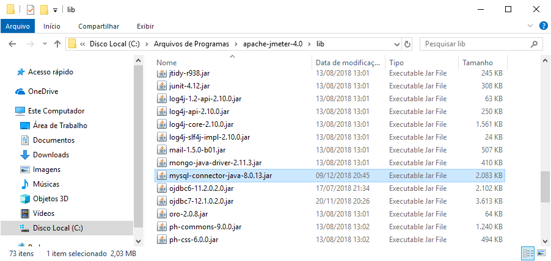
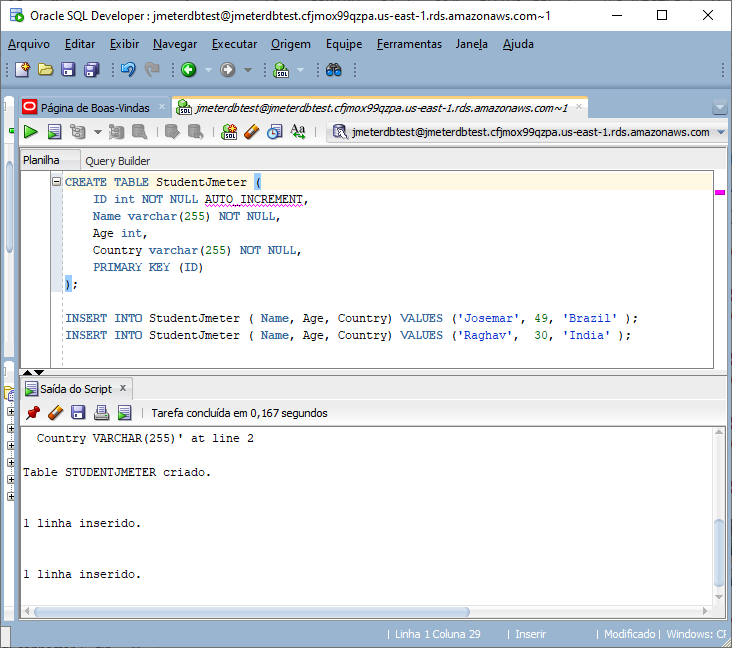
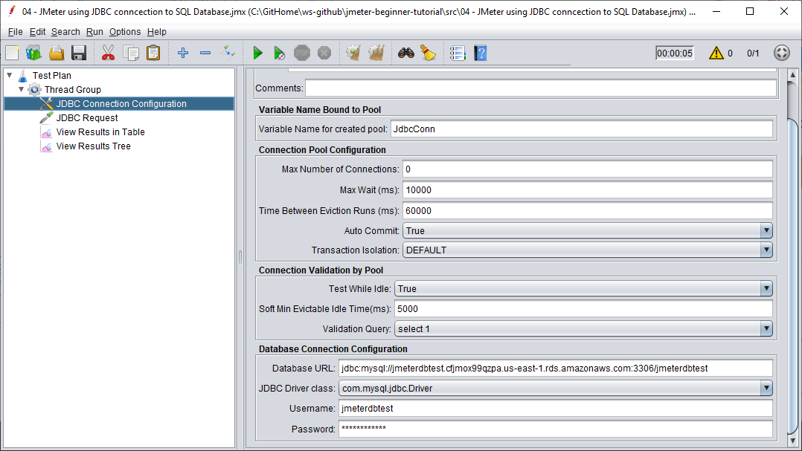
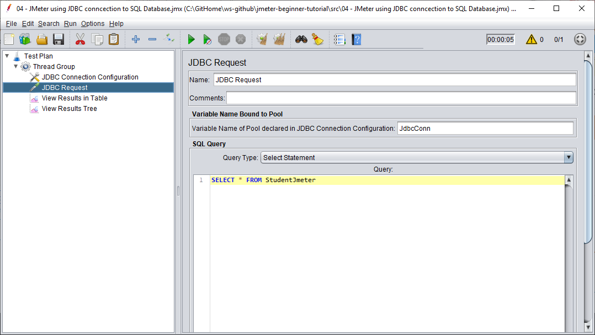
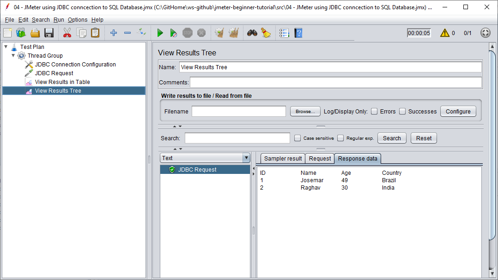
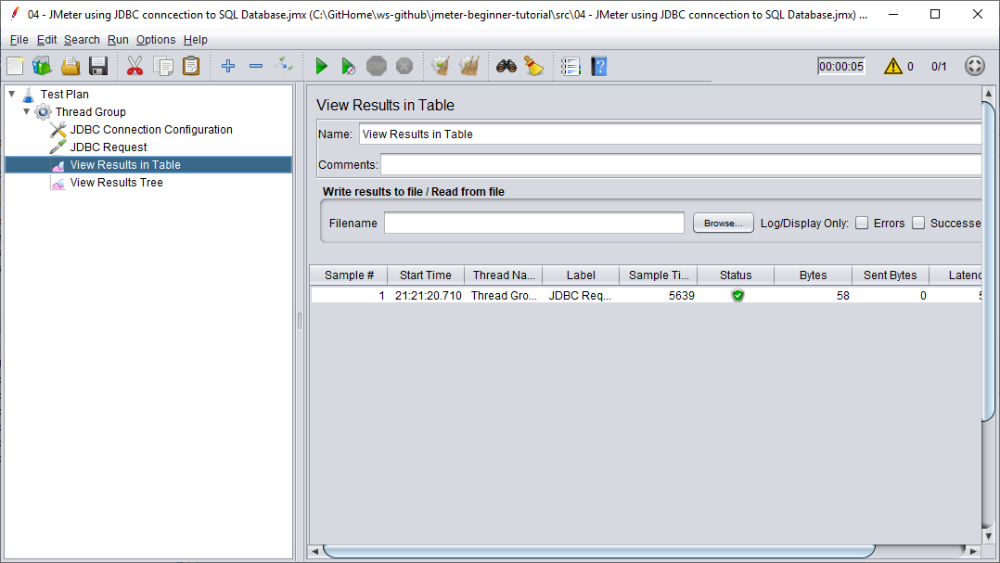

# README - Crie e configure os objetos no banco de dados para o teste do JMeter

### Step 1: Copiar o binário do JDBC driver (.jar) para a pasta (.\lib) do JMeter

### Step 2: Criar a tabela e inserir massa de dados

### Step 3: ScreenCaptured das operações JMeter

